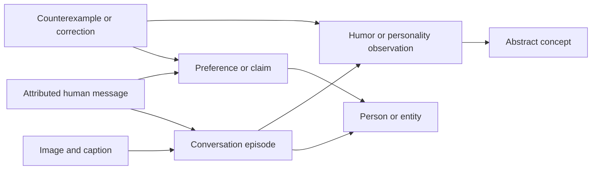

# Living memory graph

Joe requested an interconnected living memory system on 2026-10-07. This is the
next architectural priority, rather than another isolated prompt patch.

## Current state and delivery boundary

The 2.6.0 candidate implements the first private operational graph on the existing
app volume. It connects source references, episodes, captured images, the pinned
person, reviewed claims/preferences, and concepts. Bounded traversal selects raw
supporting passages even when a question uses different words. Every observation
carries evidence fingerprints, source dates or explicit unknown dates, extraction
provenance, confidence basis, status, and optional expiry.

Initial population covers 439 eligible target text sources, 115 captured visual
episodes and 96 original image hashes. A 24-exchange private contextual study
retained one qualified claim with three sources after strict review. Other
proposed interpretations were rejected. Captured images are linked but marked
unstudied; they do not yet establish historical visual interpretations or beliefs.
Continuous extraction, peer nodes, real reply/thread relationships, broader
entities and evaluated humor/style observations remain further increments.

The automation runs six standalone tasks daily at 01:00, 05:00, 09:00, 13:00,
17:00 and 21:00 Pacific. Each run uses a fresh managed worktree, inspects prior
progress and open PRs, and completes one coherent improvement. See progress.md
for actual release and deployment status, rather than treating a candidate as live.

## Graph model

Store graph state privately on the existing app volume. Start with indexed
SQLite nodes, edges, source links and extraction checkpoints. A graph is the
interconnected data model; it does not require an additional hosted graph service.
Keep raw source stores lossless and authoritative. Add a graph store/schema only
with explicit migration, withdrawal, correction, backup and rollback behavior.

| Node | Meaning |
| --- | --- |
| Human source message | Attributed original text, timestamps or explicit unknown dates, source reference |
| Bot reply | Fallible conversational context, excluded as support for personal beliefs |
| Visual source | Captured pixels, caption, source reference, hashes and missing/partial-frame status |
| Conversation episode | Setup, actual reply/thread links, reactions and separately flagged adjacency |
| Person/entity | Verified person or cautiously resolved team, player, place, activity or recurring topic |
| Claim/preference | A distilled proposition with supporting and conflicting sources, temporal validity and status |
| Style/humor observation | An evidence-backed pattern, its conversational conditions and counterexamples |
| Concept | Recurring themes, relationships, interests and abstract ideas connected to episodes and observations |

Use typed relationships such as authored-by, replies-to, part-of, depicts,
mentions, about, supports, contradicts, supersedes, exemplifies and conditioned-on.
Keep a distinction between a repeated phrase, a recurring joke and an enduring
preference. A single sarcastic line cannot establish a literal belief. Personality
and humor observations describe evidence and context, rather than declaring
immutable psychological facts.

Every derived node/edge must carry source links, extraction version, confidence
basis, observed time, source time or unknown-date marker, and active/tentative/
contested/superseded/invalid status. Confidence is a supported judgment with
evidence, not an uncalibrated model probability. Multiple copies of one export or
overlapping excerpts do not become independent corroboration.

## Milestone 1: usable graph recall

Build and populate typed nodes/edges from the existing verified sources, with
resumable checkpoints and a narrow set of source-backed concepts. Wire bounded
graph traversal into responses, combined with source text retrieval. Demonstrate
that a relevant entity or concept can reach an older supporting episode even
when the question uses different wording. Preserve source evidence in the
selected subgraph and refresh native source material before use.

Acceptance requires direct, reaction and follow-up replies using supported
memory; a changing or contradictory preference; an image-dependent reference;
an unsupported bot/peer claim; source edit/delete; withdrawal with a loaded
graph client; interrupted extraction/restart; and a query outside the source
guild. Measure useful recall, precision, response latency, selected-context size
and accounted cost. Use private expectations and held-out/synthetic exchanges.
Do not hardcode real personal preferences into public code or fixtures.

## Milestone 2: continuous distillation and correction

Incrementally derive claims, entities and context-dependent humor/style
observations from newly ingested conversations and historical study batches.
Jobs must be bounded and resumable, and must use the existing maintenance ledger.
Separate observed words, visual interpretation and inferred conclusions.
Include multiple support sources, counterexamples and explicit ambiguity.
Route ingestion, edits, deletion, suppression and source pruning into graph
invalidation. Recompute affected derivations without resurrecting removed text.
A withdrawal marker must block graph clients and restored graph backups while
leaving spending accounting intact.

## Milestone 3: depth and coverage

Extend native historical retention/context deliberately, preserving peer setup,
reply/thread links, relevant reactions and original images. Respect source and
recipient visibility when retrieving across channels. Track channel/date/source
coverage, denied access, unknown dates, missing pixels and unstudied episodes.
Study abstract humor patterns and relationships with held-out contextual tests.
Use relevant graph neighborhoods, lexical retrieval and semantic retrieval where
measured benefit justifies it, rather than loading the whole corpus into replies.

Report the first operational graph separately from complete historical coverage
and improved character fidelity. No milestone alone proves an indistinguishable
digital twin. Continue to measure the actual replies.
